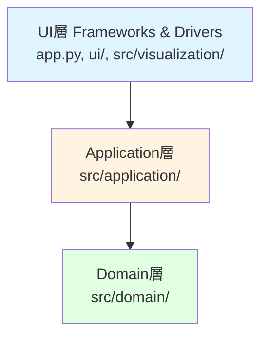
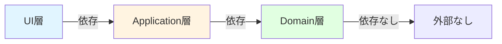

# アーキテクチャと実装詳細

**最終更新**: 2025-10-19

---

## 目次

1. [アーキテクチャ概要](#1-アーキテクチャ概要)
2. [各層の責務と設計](#2-各層の責務と設計)
3. [依存関係とデータフロー](#3-依存関係とデータフロー)
4. [設計原則の適用](#4-設計原則の適用)
5. [テスト戦略](#5-テスト戦略)

---

## 1. アーキテクチャ概要

### 1.1 全体構造

Xenharmonic Voyagerは、**Clean Architectureの原則**に基づいた3層構造を採用しています。



### 1.2 レイヤー構成

| 層 | ディレクトリ | 責務 |
|----|-------------|------|
| **UI層** | `app.py`, `ui/`, `src/visualization/` | Streamlit UI、ViewModel準備、グラフ生成 |
| **Application層** | `src/application/` | Use Case、入力検証（DTO） |
| **Domain層** | `src/domain/` | ビジネスロジック、ドメインモデル、音響計算 |

### 1.3 設計思想

#### シンプルで実用的なClean Architecture

- **小規模プロジェクト向けの最適化**: 過剰な抽象化を避け、必要最小限の層構成
- **依存性の方向**: 外側（UI）→ 内側（Domain）の単方向依存
- **テスタビリティ**: 各層が独立してテスト可能
- **保守性**: 責務が明確で、変更の影響範囲が限定的

---

## 2. 各層の責務と設計

### 2.1 Domain層（中心）

**場所**: `src/domain/`

**責務**: ビジネスロジックとドメイン知識のカプセル化

#### ファイル構成

```
src/domain/
├── constants.py       # ドメイン定数（物理定数、音響パラメータ）
├── models.py          # Value Objects（TuningSystem, Harmonic, etc.）
├── protocols.py       # インターフェース定義（TimbreModel）
├── acoustics.py       # 音響計算ロジック（Setharesモデル）
└── services.py        # Domain Service（ConsonanceCalculator）
```

#### 主要コンポーネント

**1. Value Objects (`models.py`)**
- `TuningSystem`: N-EDO音律システム（周波数計算）
- `Harmonic`: 単一倍音成分（周波数・振幅）
- `HarmonicSeries`: 倍音列
- `SawtoothTimbre`: ノコギリ波音色モデル
- `RoughnessPairResult`: ラフネス計算結果

**特徴**: すべて `frozen=True` dataclass（不変オブジェクト）

**2. 音響計算 (`acoustics.py`)**
- `critical_bandwidth()`: 臨界帯域幅計算
- `calculate_dissonance_curve()`: Setharesディソナンス曲線
- `calculate_roughness_pair()`: 2倍音間のラフネス
- `calculate_total_roughness()`: 総ラフネス

**3. Domain Service (`services.py`)**
- `ConsonanceCalculator`: 協和度計算パイプライン全体を調整
- `ConsonanceResult`: 計算結果（total_roughness、メタデータ）

#### 設計原則

- **外部依存ゼロ**: 標準ライブラリとNumPyのみ
- **純粋関数**: 副作用なし、テスト容易
- **不変性**: すべてのドメインオブジェクトは不変

---

### 2.2 Application層（調整役）

**場所**: `src/application/`

**責務**: ユースケースのオーケストレーション、入力検証

#### ファイル構成

```
src/application/
├── dto.py             # Data Transfer Object（ChordInput）
└── use_cases.py       # Use Case（CalculateConsonanceUseCase）
```

#### 主要コンポーネント

**1. DTO (`dto.py`)**
- `ChordInput`: Pydanticによる入力検証モデル
  - `edo`: 正の整数
  - `notes`: EDO範囲内の音符リスト

**2. Use Case (`use_cases.py`)**
- `CalculateConsonanceUseCase`: 協和度計算の実行
  - 入力検証
  - ドメインオブジェクト生成
  - Domain Serviceの呼び出し
  - 結果の返却

#### データフロー

```
UI層
  ↓ (edo, notes)
CalculateConsonanceUseCase.execute()
  ↓ ChordInput検証
  ↓ TuningSystem, SawtoothTimbre生成
  ↓ ConsonanceCalculator.calculate_consonance()
  ↓ ConsonanceResult
UI層
```

---

### 2.3 UI層（表示）

**場所**: `app.py`, `ui/`, `src/visualization/`

**責務**: ユーザーインターフェース、ViewModel準備

#### 構成要素

**1. Streamlitアプリ (`app.py`)**
- Use Caseの呼び出し
- セッション状態管理
- UI全体の調整

**2. UIコンポーネント (`ui/`)**
- サイドバー設定
- ステップセレクター
- 各種ビュー（分析、履歴、グラフ）

**3. Presenter層 (`src/visualization/`)**
- ViewModel準備（Streamlit非依存）
- グラフ生成（Plotly Figure）
- データ整形・集計

#### Presenter/Viewパターン

**Presenter層の役割**:
- Domain/ApplicationからのデータをUI表示用に整形
- Plotlyグラフオブジェクト生成
- **Streamlitに依存しない** → Pytestでユニットテスト可能

**View層の役割**:
- Presenterから`ViewModel`を受け取る
- `st.*`コマンドで描画のみ
- **Streamlitに依存** → 統合テスト

---

## 3. 依存関係とデータフロー

### 3.1 依存性の方向



**重要原則**: 依存性は常に外側から内側へ（UI → Application → Domain）

### 3.2 具体的な依存関係

**Domain層**:
- 依存: Python標準ライブラリ、NumPy のみ
- 被依存: Application層、UI層

**Application層**:
- 依存: Domain層、Pydantic
- 被依存: UI層

**UI層**:
- 依存: Application層、Streamlit、Plotly
- 被依存: なし

### 3.3 計算フロー（和音協和度計算）

```
1. ユーザー入力（app.py）
   ↓ edo=12, notes=[0,4,7]

2. Use Case実行（CalculateConsonanceUseCase）
   ↓ ChordInput検証
   ↓ TuningSystem(edo=12, base_frequency=440.0)
   ↓ SawtoothTimbre()

3. Domain Service（ConsonanceCalculator）
   ↓ ステップ → 周波数変換
   ↓ 各音の倍音列生成
   ↓ 全倍音ペアのラフネス計算
   ↓ 総ラフネス集計

4. 結果返却（ConsonanceResult）
   ↓ total_roughness: 0.370302

5. UI表示（Presenter → View）
   ↓ ViewModel準備
   ↓ グラフ生成
   ↓ Streamlit描画
```

---

## 4. 設計原則の適用

### 4.1 SOLID原則

**Single Responsibility（単一責任）**:
- `TuningSystem`: 周波数計算のみ
- `ConsonanceCalculator`: 協和度計算の調整のみ
- `CalculateConsonanceUseCase`: ユースケース実行のみ

**Open/Closed（開放閉鎖）**:
- `TimbreModel` Protocolによる音色モデルの拡張性
- 新しい音色（矩形波、三角波など）を追加可能

**Liskov Substitution（リスコフの置換）**:
- `TimbreModel`を実装する任意の音色モデルは交換可能

**Interface Segregation（インターフェース分離）**:
- `TimbreModel`は最小限のインターフェース（`generate_harmonics`のみ）

**Dependency Inversion（依存性逆転）**:
- `ConsonanceCalculator`は具象クラスではなく`TimbreModel` Protocolに依存

### 4.2 不変性（Immutability）

**すべてのドメインオブジェクトは不変**:
- `frozen=True` dataclass
- スレッドセーフ
- 副作用なし
- テスト容易

### 4.3 Pure Functions（純粋関数）

**ドメイン層の関数は純粋**:
- 同じ入力 → 同じ出力
- 副作用なし
- 状態変更なし

---

## 5. テスト戦略

### 5.1 層ごとのテスト方針

| 層 | テスト種別 | ツール | 焦点 |
|----|-----------|--------|------|
| **Domain層** | ユニットテスト | Pytest | ビジネスロジック、数学的正確性 |
| **Application層** | ユニットテスト | Pytest | ユースケースフロー、バリデーション |
| **Presenter層** | ユニットテスト | Pytest | ViewModel生成、グラフ構造 |
| **View層** | 統合テスト | Streamlit AppTest | UI描画、インタラクション |

### 5.2 テストの優先順位

**高優先度**:
1. Domain層の音響計算ロジック
2. Use Caseの正常系・異常系
3. Presenterのデータ整形

**中優先度**:
4. View層の統合テスト
5. エッジケース

### 5.3 カバレッジ目標

- Domain層: 90%以上
- Application層: 80%以上
- Presenter層: 70%以上
- View層: 50%以上（統合テスト中心）

---

## まとめ

Xenharmonic Voyagerのアーキテクチャは、以下の特徴を持つ:

✅ **シンプルな3層構造**: 過剰な抽象化を避けた実用的設計
✅ **明確な責務分離**: 各層が独立してテスト可能
✅ **依存性の一方向性**: UI → Application → Domain
✅ **不変性と純粋性**: ドメインモデルは不変、関数は純粋
✅ **拡張性**: Protocol による音色モデルの追加が容易

この設計により、**保守性**、**テスタビリティ**、**拡張性**が確保されています。

---

**関連ドキュメント**:
- [1001. 数学的基盤](../10.domain/1001.mathematical-foundation.md)
- [3001. テスト戦略](../30.quality/3001.testing.md)
