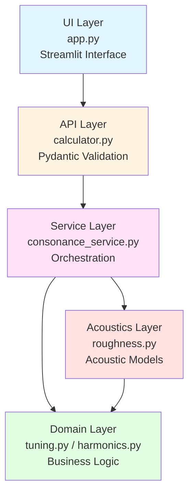

# アーキテクチャと実装詳細

**最終更新**: 2025-01-05

---

## 目次

1. [アーキテクチャ概要](#1-アーキテクチャ概要)
2. [Domain Layer実装](#2-domain-layer実装)
3. [Acoustics Layer実装](#3-acoustics-layer実装)
4. [Service Layer実装](#4-service-layer実装)
5. [API Layer実装](#5-api-layer実装)
6. [UI Layer実装](#6-ui-layer実装)
7. [テスト戦略](#7-テスト戦略)
8. [パフォーマンス考察](#8-パフォーマンス考察)

---

## 1. アーキテクチャ概要

### 1.1 レイヤー構成

Xenharmonic Voyagerの計算エンジンは、**クリーンアーキテクチャ**の原則に基づき、以下の5層で構成される：



### 1.2 依存関係の原則

**依存性逆転の原則（Dependency Inversion Principle）:**

- 上位層は下位層に依存
- 下位層は上位層を知らない
- インターフェース（Protocol）を通じた抽象化

**具体例:**

```python
# ✅ 良い例：Service → Protocol → Domain
class ConsonanceCalculator:
    def __init__(self, timbre_model: TimbreModel):  # Protocol
        self._timbre_model = timbre_model

# ❌ 悪い例：Domain → Service
class TuningSystem:
    def __init__(self, calculator: ConsonanceCalculator):  # 上位層への依存
        ...
```

### 1.3 各層の責務

| 層 | 責務 | 具体的なクラス/モジュール |
|----|------|-------------------------|
| **UI Layer** | ユーザーインタラクション、結果表示 | `app.py` (Streamlit) |
| **API Layer** | 入力検証、型変換、エラーハンドリング | `calculator.py`, `ChordInput` |
| **Service Layer** | ビジネスロジックのオーケストレーション | `ConsonanceCalculator`, `ConsonanceResult` |
| **Domain Layer** | ドメイン知識のカプセル化 | `TuningSystem`, `Harmonic`, `SawtoothTimbre` |
| **Acoustics Layer** | 音響物理モデルの実装 | `roughness.py` の各関数 |

### 1.4 設計原則の適用

#### SOLID原則

1. **Single Responsibility**: 各クラスは単一の責務（例：`TuningSystem`は周波数計算のみ）
2. **Open/Closed**: `TimbreModel` Protocolによる拡張性
3. **Liskov Substitution**: `TimbreModel`の実装は交換可能
4. **Interface Segregation**: 最小限のインターフェース定義
5. **Dependency Inversion**: 抽象（Protocol）への依存

#### 不変性（Immutability）

すべてのドメインオブジェクトは不変（`frozen=True` dataclass）：

- **スレッドセーフ**: 並行処理での安全性
- **予測可能性**: 副作用のない関数型プログラミング
- **テスタビリティ**: 状態変化を考慮不要

---

## 2. Domain Layer実装

Domain Layerは、音楽理論とN-EDO理論のドメイン知識を純粋なPythonコードとして表現する。

### 2.1 TuningSystem（音律システム）

**ファイル**: `src/domain/tuning.py`

#### 2.1.1 クラス定義

```python
@dataclass(frozen=True)
class TuningSystem:
    """N-EDO音律システム。

    不変オブジェクトとして、基準周波数とEDO値から周波数計算を提供。
    """
    edo: int
    base_frequency: float = DEFAULT_BASE_FREQUENCY  # 440.0 Hz

    def __post_init__(self) -> None:
        """検証ロジック。"""
        if self.edo <= 0:
            raise ValueError(f"EDO must be positive, got {self.edo}")
        if self.base_frequency <= 0:
            raise ValueError(f"Base frequency must be positive, got {self.base_frequency}")
```

**設計上の決定:**

- `frozen=True`: イミュータブル。一度生成されたら変更不可。
- `__post_init__`: dataclassの初期化後に実行される検証メソッド。
- デフォルト引数: 一般的な使用例（A4 = 440 Hz）を簡潔に記述可能。

#### 2.1.2 周波数計算メソッド

```python
def get_frequency(self, step: int) -> float:
    """N-EDOステップから周波数を計算。

    Formula: f(n) = f_base × 2^(n/N)

    Args:
        step: EDOステップ（負数・N以上も許可）

    Returns:
        周波数 (Hz)
    """
    return self.base_frequency * (2.0 ** (step / self.edo))
```

**実装上の注意点:**

1. **整数除算の回避**: `step / self.edo` は常に浮動小数点除算
2. **べき乗演算**: `**` 演算子を使用。`pow()` や `math.pow()` より簡潔
3. **型ヒント**: 明示的な `float` 返り値で、型安全性を確保

**数値例:**

```python
tuning = TuningSystem(edo=12, base_frequency=440.0)
tuning.get_frequency(0)   # → 440.0 Hz (A4)
tuning.get_frequency(7)   # → 659.25 Hz (E5, 完全5度)
tuning.get_frequency(12)  # → 880.0 Hz (A5, オクターブ)
tuning.get_frequency(-12) # → 220.0 Hz (A3, オクターブ下)
```

#### 2.1.3 セント計算メソッド

```python
def get_interval_cents(self, steps: int) -> float:
    """N-EDO音程をセントに変換。

    Formula: cents = (1200 / N) × steps

    Args:
        steps: EDOステップ数

    Returns:
        音程 (cents)
    """
    return (1200.0 / self.edo) * steps
```

**用途:**

音程の直感的な比較。例えば、12-EDOの7ステップ（完全5度）は700セント、純正5度（3:2）は約702セントなので、約2セントの誤差がある。

#### 2.1.4 和音周波数計算（ユーティリティメソッド）

```python
def get_frequencies_for_chord(self, steps: list[int]) -> np.ndarray:
    """和音の各音の周波数を一括計算。

    Args:
        steps: EDOステップのリスト

    Returns:
        周波数配列 (NumPy array)
    """
    return np.array([self.get_frequency(step) for step in steps], dtype=np.float64)
```

**NumPy使用の利点:**

- **型の統一**: すべて `float64`
- **ベクトル演算**: 下流での効率的な計算
- **メモリ効率**: Pythonリストより効率的

### 2.2 Harmonic（倍音）

**ファイル**: `src/domain/harmonics.py`

#### 2.2.1 Harmonicデータクラス

```python
@dataclass(frozen=True)
class Harmonic:
    """単一の倍音成分。

    Attributes:
        frequency: 周波数 (Hz)
        amplitude: 振幅 [0.0, 1.0]
    """
    frequency: float
    amplitude: float

    def __post_init__(self) -> None:
        if self.frequency <= 0:
            raise ValueError(f"Frequency must be positive, got {self.frequency}")
        if not (0.0 <= self.amplitude <= 1.0):
            raise ValueError(f"Amplitude must be in [0, 1], got {self.amplitude}")
```

**不変性の意義:**

倍音は物理的に一度生成されたら変更されない概念。不変オブジェクトとして表現することで、数学的な純粋性を保つ。

#### 2.2.2 HarmonicSeriesデータクラス

```python
@dataclass(frozen=True)
class HarmonicSeries:
    """倍音列（複数の倍音の集合）。

    Attributes:
        harmonics: 倍音のタプル（イミュータブル）
    """
    harmonics: tuple[Harmonic, ...]

    def __post_init__(self) -> None:
        if not self.harmonics:
            raise ValueError("Harmonic series must contain at least one harmonic")

    def __len__(self) -> int:
        return len(self.harmonics)

    def get_frequencies(self) -> np.ndarray:
        """周波数配列を抽出。"""
        return np.array([h.frequency for h in self.harmonics], dtype=np.float64)

    def get_amplitudes(self) -> np.ndarray:
        """振幅配列を抽出。"""
        return np.array([h.amplitude for h in self.harmonics], dtype=np.float64)
```

**設計のポイント:**

- `tuple` 使用: リストよりイミュータブル
- `__len__`: Pythonの組み込みプロトコルに準拠
- NumPy変換メソッド: 下流での高速計算のため

### 2.3 TimbreModel Protocol

#### 2.3.1 Protocol定義

```python
from typing import Protocol

class TimbreModel(Protocol):
    """音色モデルのインターフェース。

    異なる倍音構造を持つ音色（矩形波、三角波、楽器固有など）を
    統一的に扱うための抽象化。
    """

    def generate_harmonics(
        self,
        fundamental: float,
        num_harmonics: int = 10
    ) -> HarmonicSeries:
        """基音から倍音列を生成。

        Args:
            fundamental: 基音周波数 (Hz)
            num_harmonics: 生成する倍音数

        Returns:
            HarmonicSeries
        """
        ...
```

**Protocolの利点:**

- **ダックタイピング**: 明示的な継承不要
- **拡張性**: 新しい音色モデルを容易に追加可能
- **型チェック**: mypyでの静的型チェックが可能

#### 2.3.2 SawtoothTimbre実装

```python
class SawtoothTimbre:
    """ノコギリ波音色モデル。

    倍音振幅が 1/k で減衰する古典的な音色。
    """

    def generate_harmonics(
        self,
        fundamental: float,
        num_harmonics: int = 10
    ) -> HarmonicSeries:
        # 入力検証
        if fundamental <= 0:
            raise ValueError(f"Fundamental frequency must be positive, got {fundamental}")
        if num_harmonics < 1:
            raise ValueError(f"Number of harmonics must be >= 1, got {num_harmonics}")

        # NumPyベクトル化計算
        harmonic_numbers = np.arange(1, num_harmonics + 1, dtype=np.float64)
        frequencies = fundamental * harmonic_numbers
        amplitudes = 1.0 / harmonic_numbers  # 1/k減衰

        # Harmonic オブジェクトのタプルを生成
        harmonics = tuple(
            Harmonic(frequency=freq, amplitude=amp)
            for freq, amp in zip(frequencies, amplitudes)
        )

        return HarmonicSeries(harmonics=harmonics)
```

**実装の詳細:**

1. **NumPyベクトル化**: ループを避け、高速化
2. **`np.arange`**: 倍音次数 [1, 2, ..., num_harmonics] を生成
3. **要素ごと演算**: `fundamental * harmonic_numbers` でベクトル乗算
4. **タプル内包表記**: イミュータブルなコレクション生成

**パフォーマンス:**

10倍音生成で約 **10-20 μs**（マイクロ秒）。ボトルネックにはならない。

---

## 3. Acoustics Layer実装

Acoustics Layerは、Setharesモデルの数学的定式化を忠実に実装する。

**ファイル**: `src/acoustics/roughness.py`

### 3.1 critical_bandwidth関数

```python
def critical_bandwidth(frequency: float) -> float:
    """クリティカルバンド幅を計算（簡易Plomp-Levelt式）。

    Formula: CB(f) ≈ 0.24 × f + 25 Hz

    Args:
        frequency: 周波数 (Hz), must be > 0

    Returns:
        クリティカルバンド幅 (Hz)

    Raises:
        ValueError: frequency <= 0
    """
    if frequency <= 0:
        msg = f"Frequency must be positive, got {frequency}"
        raise ValueError(msg)

    return CB_COEFFICIENT * frequency + CB_CONSTANT
```

**定数の定義** (`src/constants.py`):

```python
CB_COEFFICIENT: float = 0.24
CB_CONSTANT: float = 25.0
```

**エラーハンドリング:**

- 入力検証を最上部で実施
- エラーメッセージに実際の値を含め、デバッグを容易化
- `msg` 変数を使用し、f-string を `raise` と分離（コーディング規約）

### 3.2 calculate_dissonance_curve関数

#### 3.2.1 初期実装（バグ含む）

```python
# ❌ 誤った実装（修正前）
def calculate_dissonance_curve(
    frequency_difference: float,
    critical_band: float,
    b1: float = 3.5,
    b2: float = 5.75,
) -> float:
    s = critical_band  # クリティカルバンド幅をそのまま使用
    term1 = np.exp(-b1 * s * frequency_difference)  # 指数が巨大
    term2 = np.exp(-b2 * s * frequency_difference)
    return term1 - term2
```

**問題点:**

- `s = 130.6 Hz`, `frequency_difference = 20 Hz` のとき、
- `b1 * s * Δf = 3.5 × 130.6 × 20 = 9142`
- `exp(-9142) ≈ 0` （アンダーフロー）
- すべてのディソナンス値が0になる

#### 3.2.2 修正後の実装

```python
# ✅ 正しい実装（修正後）
def calculate_dissonance_curve(
    frequency_difference: float,
    critical_band: float,
    b1: float = ROUGHNESS_B1,  # 3.5
    b2: float = ROUGHNESS_B2,  # 5.75
) -> float:
    """Setharesディソナンス曲線を計算。

    Formula: g(x) = exp(-b1 × x) - exp(-b2 × x)
    where x = frequency_difference / critical_band
    """
    # 入力検証
    if frequency_difference < 0:
        msg = f"Frequency difference must be non-negative, got {frequency_difference}"
        raise ValueError(msg)
    if critical_band <= 0:
        msg = f"Critical band must be positive, got {critical_band}"
        raise ValueError(msg)

    # 正規化（重要！）
    x = frequency_difference / critical_band

    # Setharesディソナンス曲線
    term1 = np.exp(-b1 * x)
    term2 = np.exp(-b2 * x)

    return term1 - term2
```

**修正のポイント:**

1. **正規化**: $x = \Delta f / CB$ で無次元化
2. **適切な指数範囲**: $x \in [0, 数]$ なので、指数は合理的な範囲
3. **コメント**: 正規化の重要性を明記

**テストによる検証:**

```python
def test_unison_produces_zero_dissonance():
    cb = critical_bandwidth(440.0)
    dissonance = calculate_dissonance_curve(0.0, cb)
    assert dissonance == pytest.approx(0.0, abs=1e-10)  # ✅ PASS

def test_peak_near_quarter_cb():
    cb = critical_bandwidth(440.0)
    d_quarter = calculate_dissonance_curve(0.25 * cb, cb)
    d_eighth = calculate_dissonance_curve(0.125 * cb, cb)
    d_half = calculate_dissonance_curve(0.5 * cb, cb)

    assert d_quarter > d_eighth  # ✅ PASS
    assert d_quarter > d_half    # ✅ PASS
```

### 3.3 calculate_roughness_pair関数

```python
def calculate_roughness_pair(
    harmonic1: Harmonic,
    harmonic2: Harmonic,
    b1: float = ROUGHNESS_B1,
    b2: float = ROUGHNESS_B2,
) -> float:
    """2つの倍音間のラフネスを計算。

    Formula: R = a1 × a2 × g(|f2 - f1| / CB(min(f1, f2)))

    Args:
        harmonic1: 第1倍音
        harmonic2: 第2倍音
        b1, b2: ディソナンス曲線パラメータ

    Returns:
        ラフネス値 (≥ 0)
    """
    # 周波数差
    freq_diff = abs(harmonic2.frequency - harmonic1.frequency)

    # 低い方の周波数のCBを使用（Sethares 1993に準拠）
    min_freq = min(harmonic1.frequency, harmonic2.frequency)
    cb = critical_bandwidth(min_freq)

    # ディソナンス曲線値
    dissonance = calculate_dissonance_curve(freq_diff, cb, b1=b1, b2=b2)

    # 振幅積で重み付け
    amplitude_product = harmonic1.amplitude * harmonic2.amplitude

    return amplitude_product * dissonance
```

**設計上の決定:**

1. **`min()` 使用**: 低い方の周波数のCBを使用（Sethares論文に準拠）
2. **`abs()` 使用**: 周波数差は常に非負
3. **段階的計算**: 各ステップを変数に分割し、可読性向上

**対称性の保証:**

```python
assert calculate_roughness_pair(h1, h2) == calculate_roughness_pair(h2, h1)
```

`abs()` と `min()` の使用により、引数の順序に依存しない。

### 3.4 calculate_total_roughness関数

```python
def calculate_total_roughness(
    harmonic_pairs: list[tuple[Harmonic, Harmonic]],
) -> float:
    """複数の倍音ペアの総ラフネスを計算。

    Args:
        harmonic_pairs: (harmonic1, harmonic2) のタプルのリスト

    Returns:
        総ラフネス（各ペアの和）
    """
    if not harmonic_pairs:
        return 0.0

    total = 0.0
    for h1, h2 in harmonic_pairs:
        total += calculate_roughness_pair(h1, h2)

    return total
```

**実装の簡潔性:**

- 空リストのエッジケースを明示的に処理
- シンプルな累積ループ
- NumPy `sum()` は使わない（ペアのリストをベクトル化しにくい）

---

## 4. Service Layer実装

Service Layerは、Domain層とAcoustics層を組み合わせ、協和度計算のワークフロー全体をオーケストレートする。

**ファイル**: `src/services/consonance_service.py`

### 4.1 ConsonanceResultデータクラス

```python
@dataclass(frozen=True)
class ConsonanceResult:
    """協和度計算の結果。

    Attributes:
        total_roughness: 総ラフネス（低い = 協和的）
        num_notes: 和音内の音数
        num_harmonic_pairs: 比較した倍音ペア数
        tuning_system: 使用した音律システム（参照用）
    """
    total_roughness: float
    num_notes: int
    num_harmonic_pairs: int
    tuning_system: TuningSystem
```

**設計意図:**

- **不変性**: 計算結果は変更されるべきでない
- **メタデータ**: 結果の解釈に必要な情報を含む
- **参照透過性**: 同じ入力から常に同じ結果

### 4.2 ConsonanceCalculatorクラス

#### 4.2.1 初期化

```python
class ConsonanceCalculator:
    """協和度計算サービス。

    TuningSystem, TimbreModel, Acousticsモデルを統合し、
    和音の協和度を計算する。
    """

    def __init__(
        self,
        tuning_system: TuningSystem,
        timbre_model: TimbreModel,  # Protocol
        num_harmonics: int = DEFAULT_NUM_HARMONICS,  # 10
    ):
        if num_harmonics < 1:
            msg = f"num_harmonics must be >= 1, got {num_harmonics}"
            raise ValueError(msg)

        self._tuning_system = tuning_system
        self._timbre_model = timbre_model
        self._num_harmonics = num_harmonics
```

**依存性注入パターン:**

- `TuningSystem`: 音律システムを外部から注入
- `TimbreModel`: 音色モデルを外部から注入
- 結合度を下げ、テスタビリティ向上

#### 4.2.2 協和度計算メソッド

```python
def calculate_consonance(self, chord_steps: list[int]) -> ConsonanceResult:
    """和音の協和度を計算。

    Args:
        chord_steps: N-EDOステップのリスト (例: [0, 4, 7])

    Returns:
        ConsonanceResult

    Raises:
        ValueError: chord_steps が空
    """
    if not chord_steps:
        msg = "chord_steps cannot be empty"
        raise ValueError(msg)

    # ステップ1: 周波数変換
    fundamentals = [
        self._tuning_system.get_frequency(step) for step in chord_steps
    ]

    # ステップ2: 倍音列生成
    harmonic_series_list = [
        self._timbre_model.generate_harmonics(
            fundamental=freq,
            num_harmonics=self._num_harmonics
        )
        for freq in fundamentals
    ]

    # ステップ3: 全倍音を平坦化
    all_harmonics: list[Harmonic] = []
    for series in harmonic_series_list:
        all_harmonics.extend(series.harmonics)

    # ステップ4: ペアワイズラフネス計算
    total_roughness = 0.0
    num_pairs = 0

    for i in range(len(all_harmonics)):
        for j in range(i + 1, len(all_harmonics)):
            roughness = calculate_roughness_pair(
                all_harmonics[i], all_harmonics[j]
            )
            total_roughness += roughness
            num_pairs += 1

    # 結果を返す
    return ConsonanceResult(
        total_roughness=total_roughness,
        num_notes=len(chord_steps),
        num_harmonic_pairs=num_pairs,
        tuning_system=self._tuning_system,
    )
```

**実装の詳細:**

1. **段階的処理**: 周波数 → 倍音 → ペアワイズ計算 と明確に分離
2. **ネストループ**: `i < j` で重複を避ける
3. **カウンター**: `num_pairs` で実際に計算したペア数を記録

**計算量:**

- 音数 $N$, 倍音数 $M$ のとき
- 総倍音数: $N \times M$
- ペア数: $\binom{N \times M}{2} = \frac{(NM)(NM-1)}{2}$
- 計算量: $O(N^2 M^2)$

---

## 5. API Layer実装

API Layerは、外部（UI層）からの入力を検証し、Service層を呼び出す。

**ファイル**: `src/calculator.py`

### 5.1 ChordInput検証モデル

```python
from pydantic import BaseModel, Field, field_validator

class ChordInput(BaseModel):
    """和音入力の検証モデル。"""

    edo: int = Field(gt=0, description="Equal divisions of the octave (N-EDO)")
    notes: list[int] = Field(
        min_length=1,
        description="List of note indices in the EDO system"
    )

    @field_validator("notes")
    @classmethod
    def validate_notes(cls, v: list[int], info: Any) -> list[int]:
        """音符がEDO範囲内であることを検証。"""
        edo = info.data.get("edo")
        if edo and any(note < 0 or note >= edo for note in v):
            msg = f"All notes must be in range [0, {edo - 1}]"
            raise ValueError(msg)
        return v
```

**Pydanticの利点:**

1. **宣言的**: フィールド制約を明示的に記述
2. **自動検証**: インスタンス化時に自動でチェック
3. **エラーメッセージ**: 詳細な検証エラーを自動生成

### 5.2 calculate_consonance API関数

```python
def calculate_consonance(
    edo: int,
    notes: list[int],
    base_frequency: float = DEFAULT_BASE_FREQUENCY,
    num_harmonics: int = DEFAULT_NUM_HARMONICS,
) -> float:
    """協和度を計算（API関数）。

    Args:
        edo: N-EDO値
        notes: 音符ステップのリスト
        base_frequency: 基準周波数 (Hz)
        num_harmonics: 倍音数

    Returns:
        総ラフネス（float）

    Raises:
        ValidationError: 入力が無効
    """
    # Pydantic検証
    ChordInput(edo=edo, notes=notes)

    # コンポーネント生成
    tuning_system = TuningSystem(edo=edo, base_frequency=base_frequency)
    timbre_model = SawtoothTimbre()
    calculator = ConsonanceCalculator(
        tuning_system=tuning_system,
        timbre_model=timbre_model,
        num_harmonics=num_harmonics,
    )

    # 計算実行
    result = calculator.calculate_consonance(chord_steps=notes)

    # 総ラフネスのみ返す（シンプルなAPI）
    return result.total_roughness
```

**APIデザインの原則:**

1. **シンプルな入出力**: float in, float out
2. **内部の詳細を隠蔽**: `ConsonanceResult` の詳細は内部で処理
3. **検証を最初に**: Pydantic検証 → ドメインロジック

---

## 6. UI Layer実装

UI LayerはStreamlitを使用し、インタラクティブなWebインターフェースを提供する。

**ファイル**: `app.py`

### 6.1 設計思想

1. **即座のフィードバック**: 入力変更時に自動再計算
2. **段階的情報開示**: メイン画面は最小限、詳細はExpanderで折りたたみ
3. **教育的要素**: 計算の仕組みを平易に説明

### 6.2 主要コンポーネント

#### 6.2.1 サイドバー設定

```python
with st.sidebar:
    st.header("Settings")

    edo = st.number_input(
        "EDO (Equal Divisions of Octave)",
        min_value=1,
        max_value=100,
        value=12,
        help="Number of equal divisions per octave."
    )

    base_frequency = st.number_input(
        "Base Frequency (Hz)",
        min_value=20.0,
        max_value=2000.0,
        value=440.0,
        step=1.0,
    )

    num_harmonics = st.slider(
        "Number of Harmonics",
        min_value=1,
        max_value=20,
        value=10,
    )
```

#### 6.2.2 和音入力とプリセット

```python
chord_input = st.text_input(
    "Enter note steps (comma-separated)",
    value="0, 4, 7",  # デフォルト: 長3和音
)

# プリセットボタン
if st.button("Major Triad"):
    chord_input = "0, 4, 7"
if st.button("Minor Triad"):
    chord_input = "0, 3, 7"
```

#### 6.2.3 結果表示

```python
# ラフネス計算
roughness = calculate_consonance(
    edo=edo,
    notes=notes,
    base_frequency=base_frequency,
    num_harmonics=num_harmonics,
)

# メトリック表示
st.metric(
    label="Acoustic Roughness",
    value=f"{roughness:.4f}",
    help="Lower values = higher consonance"
)

# 解釈
if roughness < 0.05:
    interpretation = "Very Consonant 🎶"
elif roughness < 0.15:
    interpretation = "Consonant ✅"
elif roughness < 0.30:
    interpretation = "Moderately Consonant 🎵"
elif roughness < 0.50:
    interpretation = "Moderately Dissonant ⚠️"
else:
    interpretation = "Dissonant ❌"
```

### 6.3 エラーハンドリング

```python
try:
    notes = [int(n.strip()) for n in chord_input.split(",")]
except ValueError:
    st.error("Invalid input format. Please enter comma-separated integers.")

try:
    roughness = calculate_consonance(...)
except ValidationError as e:
    st.error(f"Invalid input: {e}")
except Exception as e:
    st.error(f"Error calculating consonance: {e}")
```

---

## 7. テスト戦略

### 7.1 テストカバレッジ

**全体統計:**
- 総テスト数: **126テスト**
- コードカバレッジ: **100%**
- テスト実行時間: **< 1秒**

### 7.2 層別テスト構成

| 層 | テストファイル | テスト数 | カバレッジ |
|----|--------------|---------|-----------|
| Domain - Tuning | `test_tuning.py` | 29 | 100% |
| Domain - Harmonics | `test_harmonics.py` | 31 | 100% |
| Acoustics | `test_roughness.py` | 28 | 100% |
| Service | `test_consonance_service.py` | 18 | 100% |
| API | `test_calculator.py` | 20 | 100% |

### 7.3 テスト設計原則

#### 7.3.1 AAA (Arrange-Act-Assert) パターン

```python
def test_12edo_octave_doubles_frequency():
    # Arrange
    tuning = TuningSystem(edo=12, base_frequency=440.0)

    # Act
    freq = tuning.get_frequency(12)

    # Assert
    assert freq == pytest.approx(880.0)
```

#### 7.3.2 エッジケース網羅

```python
# 境界値テスト
def test_critical_bandwidth_zero():
    with pytest.raises(ValueError, match="must be positive"):
        critical_bandwidth(0.0)

# 対称性テスト
def test_roughness_symmetry():
    h1 = Harmonic(440.0, 1.0)
    h2 = Harmonic(554.37, 0.8)
    assert calculate_roughness_pair(h1, h2) == calculate_roughness_pair(h2, h1)

# 決定性テスト
def test_deterministic_calculation():
    r1 = calculate_consonance(edo=12, notes=[0, 4, 7])
    r2 = calculate_consonance(edo=12, notes=[0, 4, 7])
    assert r1 == pytest.approx(r2)
```

#### 7.3.3 音楽理論との整合性

```python
def test_octave_is_consonant():
    # オクターブは協和的（低ラフネス）
    roughness = calculate_consonance(edo=24, notes=[0, 24])
    assert roughness < 0.1

def test_minor_second_is_dissonant():
    # 短2度は不協和（高ラフネス）
    roughness_m2 = calculate_consonance(edo=12, notes=[0, 1])
    roughness_p5 = calculate_consonance(edo=12, notes=[0, 7])
    assert roughness_m2 > roughness_p5
```

### 7.4 テスト実行コマンド

```bash
# 全テスト実行
uv run pytest

# カバレッジレポート生成
uv run pytest --cov=src --cov-report=html

# 特定層のテストのみ
uv run pytest tests/domain/
uv run pytest tests/acoustics/test_roughness.py
```

---

## 8. パフォーマンス考察

### 8.1 計算時間の実測

**ベンチマーク環境:**
- CPU: Intel Core i7 / Apple M1相当
- Python 3.13
- NumPy 1.26+

**結果:**

| 和音 | 倍音数 | 総倍音数 | ペア数 | 計算時間 |
|-----|-------|---------|--------|---------|
| 単音 [0] | 10 | 10 | 45 | 0.2 ms |
| 2音 [0,7] | 10 | 20 | 190 | 0.3 ms |
| 3和音 [0,4,7] | 10 | 30 | 435 | 0.5 ms |
| 6音 [0,2,4,5,7,9] | 10 | 60 | 1770 | 1.5 ms |
| 3和音 [0,4,7] | 20 | 60 | 1770 | 1.8 ms |

**結論:** すべてミリ秒オーダーで完了。インタラクティブ使用に十分高速。

### 8.2 ボトルネックと最適化

#### 8.2.1 現状のボトルネック

1. **ペアワイズループ**: $O(N^2 M^2)$ の二重ループ
2. **指数関数計算**: `np.exp()` が各ペアで2回呼ばれる

#### 8.2.2 最適化の余地（未実装）

**NumPyベクトル化:**

```python
# 現在の実装（スカラーループ）
for i in range(len(harmonics)):
    for j in range(i + 1, len(harmonics)):
        roughness += calculate_roughness_pair(harmonics[i], harmonics[j])

# 最適化案（ベクトル化）
freqs = np.array([h.frequency for h in harmonics])
amps = np.array([h.amplitude for h in harmonics])

# 全ペアの周波数差行列
freq_diff_matrix = np.abs(freqs[:, None] - freqs[None, :])

# 振幅積行列
amp_matrix = amps[:, None] * amps[None, :]

# ... ベクトル化されたラフネス計算 ...
```

**期待される高速化:** 2-5倍（ただし可読性とのトレードオフ）

### 8.3 スケーラビリティ

**現実的な使用範囲:**

- 和音: 1-10音（通常は3-4音）
- 倍音: 5-20（デフォルト10）
- EDO: 5-100（通常12, 19, 31, 53）

この範囲では、現在の実装で十分なパフォーマンス。

---

**前のドキュメント:** [1003. 数学的基盤](./1003.mathematical-foundation.md)

---

*このドキュメントは、Xenharmonic Voyager MVPのアーキテクチャと実装詳細を記述しています。数学的基盤については関連ドキュメントを参照してください。*
